# Public Grievance

**DIGIT PGR User Manual**

**Copyright**

Copyright © 2020 eGovernments Foundation. All rights reserved worldwide.

This document contains proprietary information of eGovernments Foundation and has been provided pursuant to an agreement containing terms of its use. This document is also protected by Indian and worldwide copyright laws.

No part of this document may be reproduced or distributed, transcribed, stored in a retrieval system, translated into any spoken or computer language or transmitted in any form or by any means whatsoever without the prior written consent of eGovernments Foundation.

Jambudvipa

\# 147 /J,1st floor, 10th cross,

12th main, 3rd block,

Koramangala

Bangalore-560034

eGovernments is a trademark of eGovernments Foundation.

It is clarified that eGovernments Foundation retains the right to reproduce, distribute or communicate the contents and/or subject matter of this document in part or whole and in any manner or form, to any other entity of its choice, under the terms that it so desires. Such an act will not lead to the derogation of the rights of any entity involved.

## 

## About this manual

The Public Grievance Redressal or the PGR is a standardized solution offering on DIGIT platform to register and redress citizen grievances. It provides a transparent and trackable mechanism to solve public grievances by inducing responsive administration. PGR enables the citizens to file the complaints using various channels and helps the municipal employees to resolve them in a timebound manner.

This document acts as an easy reference for citizens and ULB employees using the PGR module. The user manual presents an overview of the PGR functions and gives step-by-step instructions for completing a variety of tasks.

Table of Contents

[DIGIT PGR User Manual]()

[About this manual]()

[Intended audience]()

[Document conventions]()

[Document version history]()

[Introduction to PGR]()

[Features and applications]()

[User roles]()

[Getting Started with PGR]()

[Logging in to PGR]()

[Edit Profile]()

[Logging out]()

[Using PGR]()

[Citizens]()

[File Complaints]()

[My Complaints]()

[Complaint Types List]()

[CSR]()

[Search or Track Complaints]()

[File Complaints]()

[GRO]()

[Assign Complaints]()

[Re-Assign Complaints]()

[Reject Complaints]()

[FME]()

[Request Re-Assign]()

[Mark Resolved]()

[Creating PGR Reports]()

[Generating Reports]()

[Navigating Reports]()

[Saving Reports]()

[Modifying Reports]()

[Downloading Reports]()

## Intended audience

The intended audience for this user manual include -

1. Citizens
2. ULB employees
3. State employees

## Document conventions

| **If you see…..** | **It means….** |
| :--- | :--- |
| **Bold Text** | Screen elements like buttons, drop-down lists, input fields, and such UI elements are highlighted in Bold |
| _Italicized text_ | _The word or set of words is especially emphasized._ |
|  **&gt;** | The Arrow ‘&gt;’ notation describes the flow of navigation in The Arrow ‘&gt;’ notation describes the flow of navigation in the application |
| Note:  | The text following this icon provides additional information |
| Tip:  | The text following this icon provides suggestive use |
|  | The field following this icon is a Mandatory field |
|  | The text following this icon indicates a call for attention |

## Document version history

| **Version Number** | **Release Date** | **Release Description** |
| :--- | :--- | :--- |
| Version 2.0 |  |  |
|  |  |  |

## Introduction to PGR

The Public Grievance Redressal \(PGR\) module allows citizens to register their complaints through the web portal or the mobile application. Once registered, the urban local body employees act on the complaints and works on it until the reported issue is resolved. The module facilitates a transparent and timely resolution of public grievances.

The PGR module is a part of the mSeva or the ULB application.

### Features and applications

The module supports the following key functions -

1. File a complaint
2. Track complaint
3. Rate complaints
4. Reopen complaints
5. Assign complaints
6. Reject complaints
7. Request re-assign
8. Re-assign complaints
9. Resolve complaints
10. View dashboard analytics
11. Access MIS reports

### User roles

Refer to the table below to understand the different user roles and the scope of action linked to each role. The manual provides a detailed description of how to use the system for each role.

<table>
  <thead>
    <tr>
      <th style="text-align:left"><b>User Role</b>
      </th>
      <th style="text-align:left"><b>Scope of Action</b>
      </th>
      <th style="text-align:left"><b>Role Description</b>
      </th>
    </tr>
  </thead>
  <tbody>
    <tr>
      <td style="text-align:left">Citizen</td>
      <td style="text-align:left">
        
File Complaints

        
Track Complaints

        
Rate Complaints

        
Reopen Complaints

      </td>
      <td style="text-align:left">Individuals and society groups/communities</td>
    </tr>
    <tr>
      <td style="text-align:left">Customer Service Representative (CSR)</td>
      <td style="text-align:left">
        
File Complaints

        
Track Complaints

        
Reopen Complaints

      </td>
      <td style="text-align:left">Counter employees who assist citizens and register complaints on their
        behalf</td>
    </tr>
    <tr>
      <td style="text-align:left">Grievance Routing Officer (GRO)</td>
      <td style="text-align:left">
        
Assign Complaints to FME

        
Rejects Complaints

      </td>
      <td style="text-align:left">ULB officers who assign complaints to concerned employees</td>
    </tr>
    <tr>
      <td style="text-align:left">First Mile Employee (FME)</td>
      <td style="text-align:left">
        
Resolve Complaints

        
Request Re-assign

      </td>
      <td style="text-align:left">Employees who work on assigned complaints</td>
    </tr>
    <tr>
      <td style="text-align:left">ULB Admin</td>
      <td style="text-align:left">
        
Reports

        
Analytics

      </td>
      <td style="text-align:left">Monitors employee and department performance at the ULB level</td>
    </tr>
    <tr>
      <td style="text-align:left">State Admin</td>
      <td style="text-align:left">
        
Reports

        
Analytics

      </td>
      <td style="text-align:left">Monitors performance of ULBs at the State level</td>
    </tr>
  </tbody>
</table>

## 

## Getting Started with PGR

This section of the user manual guides you through the user login process. Citizens can sign up to use the PGR module through the online web portal or the mobile application login interface.

### Logging in to PGR

To log in as a Citizen user

1. Enter the ULB url in your browser. For instance, people of Punjab will use the link [https://mseva.lgpunjab.gov.in/citizen/user/register](https://mseva.lgpunjab.gov.in/citizen/user/register) to register for Punjab mSeva services.

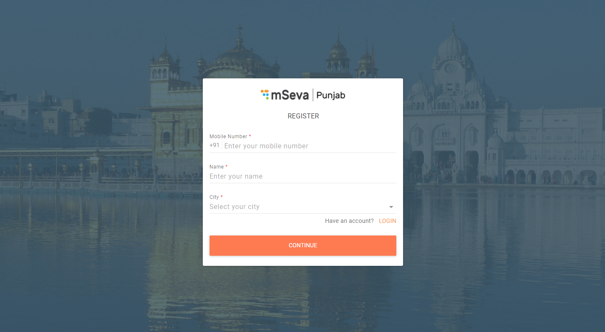

1. Enter your **Mobile Number** to register as a user.
2. Enter your **Name**.
3. Select your city from the **City** drop-down list.
4. Click on the **Continue** button.
5. The system sends an OTP to your mobile number. Enter the **OTP**.

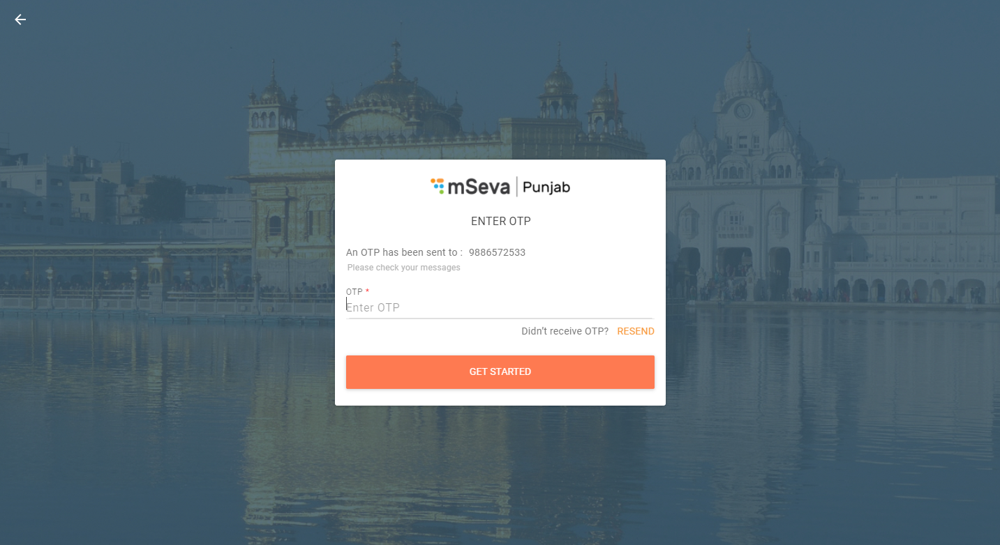

1. Click on the **Resend** button on the screen in case you have not received your OTP.
2. Click on the **Get Started** button.
3. You are logged in to the mSeva app.

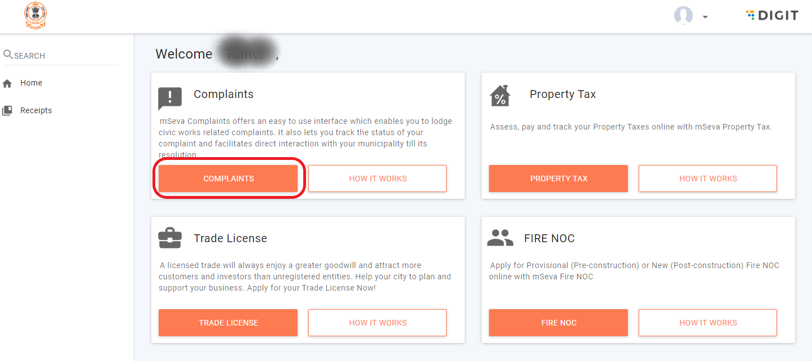

1. Click on the **Complaints** tab to file a complaint.

### Edit Profile

To change your account details

1. Click on the drop-down icon next to your profile logo on the top right corner of the window.

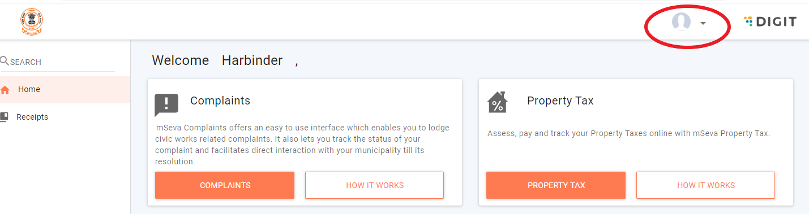

1. Click on **Edit Profile**.

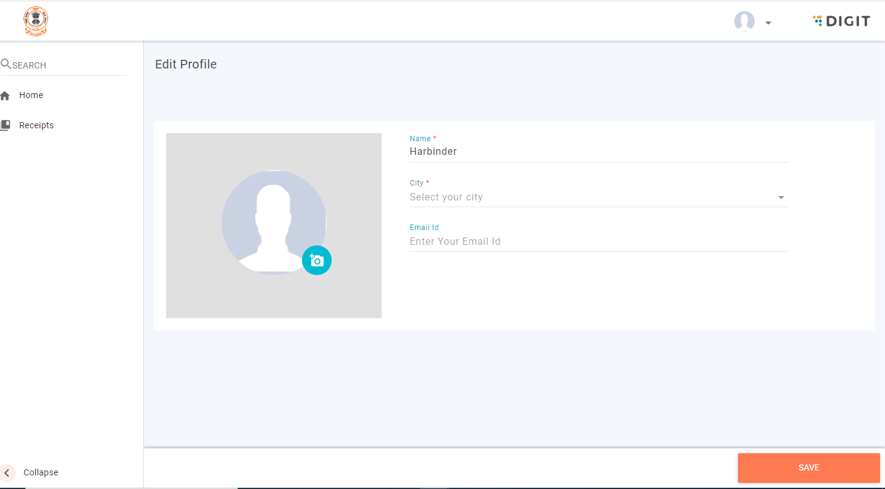

1. Enter your new user **Name** if you want to change the existing profile name.
2. Select the applicable **City** from the drop-down list if you want to change your city settings.
3. Enter your **Email Id** if you want to reset your email address.
4. Click on the camera  icon to upload or change your Profile photo.
   1. Click on **Gallery** button to select an image from your photo gallery or files on the computer.

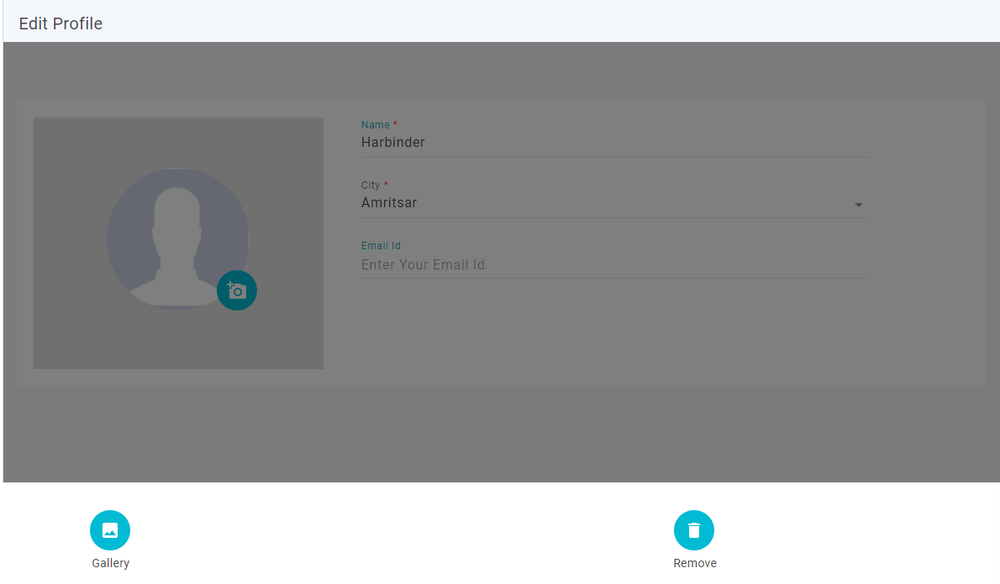

* 1. Select the file and click on the **Open** button. This will load the selected image as the profile picture.
  2. Click on the **Remove** button to delete the existing profile picture.

1. Click on **Save** button.

The profile changes are saved and applied.

### Logging out

To log out from the app

1. Click on the drop-down icon next to your profile logo on the top right corner of the window.
2. Click on **Logout**.

You are logged out of the system.

## 

## Using PGR

This section guides you through the details of using the PGR module for each role. Click on the relevant role below to learn more about how to use the PGR system.

1. Citizens
2. CSR
3. GRO
4. FME

### Citizens

Citizens represent individuals or communities who are the system end-users. The PGR module provides the citizens with the scope to file their complaints or grievances to initiate necessary action.

The Citizen role can -

1. File complaints
2. View their complaints
3. Rate Complaints

#### File Complaints

The File Complaints option allows citizens to register their complaints.

To file complaints

1. Navigate to Complaints **Home** page.
2. Click on **File Complaints** tab on the screen. This will open the complaint form page.

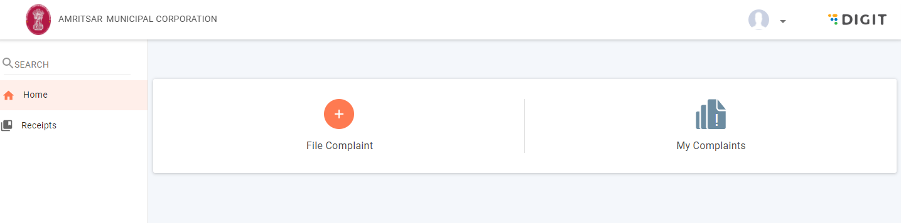

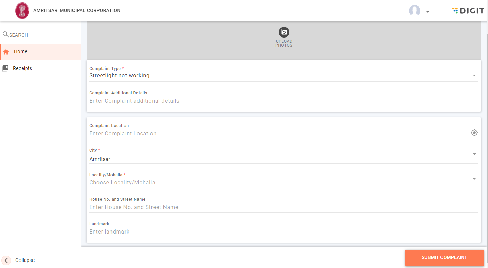

1. Select the relevant **Complaint Type** and the sub-type from the drop-down list of options. Refer to the list of complaint types available in PGR.
2. Enter any additional information in the **Complaint Additional Details** field.
3. Click on the map  icon to pinpoint the **Complaint Location**.
4. The **City** field will display the city specified in your profile by default. You can change the city if required.
5. Choose the applicable **Locality/Mohalla** from the drop-down list.
6. Enter the **House No. and Street Name**.
7. Enter any **Landmark** to identify the exact location for the listed complaint.
8. Click on the camera  icon to upload any photos for the complaint.
9. Click on **Submit Complaint** button once you have finished filling in all the details.

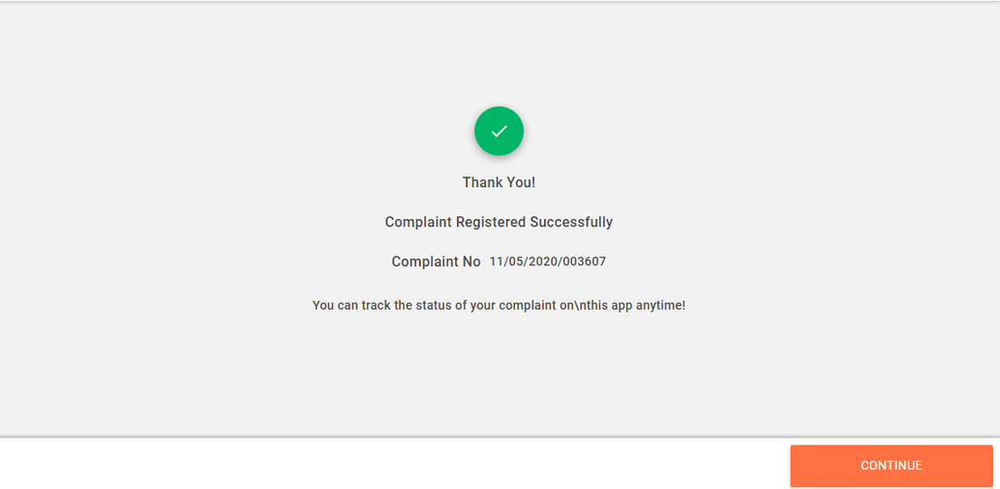

1. The system will display the Complaint Registered Successfully message along with the Complaint No.
2. Click on the **Continue** button. Your complaint details are available on the dashboard.

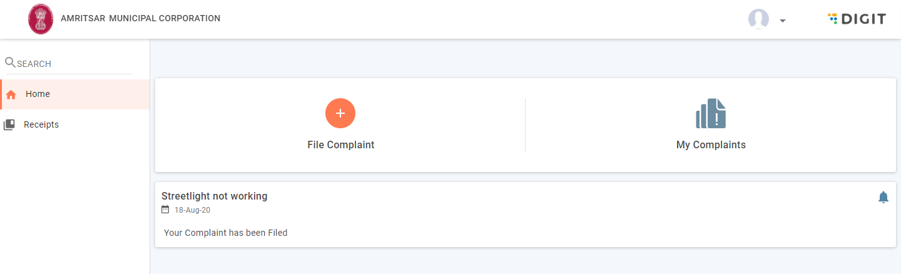

1. The bell icon on the top right corner of the complaint tab will display any notifications received for the complaint.
2. Click on the bell  icon to view the complaint details.

#### My Complaints

My Complaints tab enables citizens to track the status of their complaints.

To view or track complaints

1. Click on **My Complaints** tab.
2. The system will display all complaints filed by you or from your account and the corresponding status.

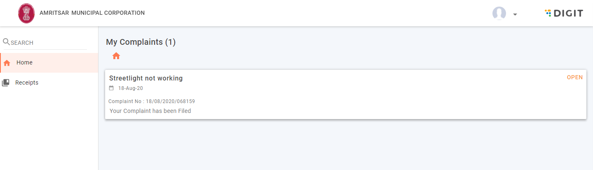

1. Click on the **Open** button corresponding to any complaint to view the complaint details.

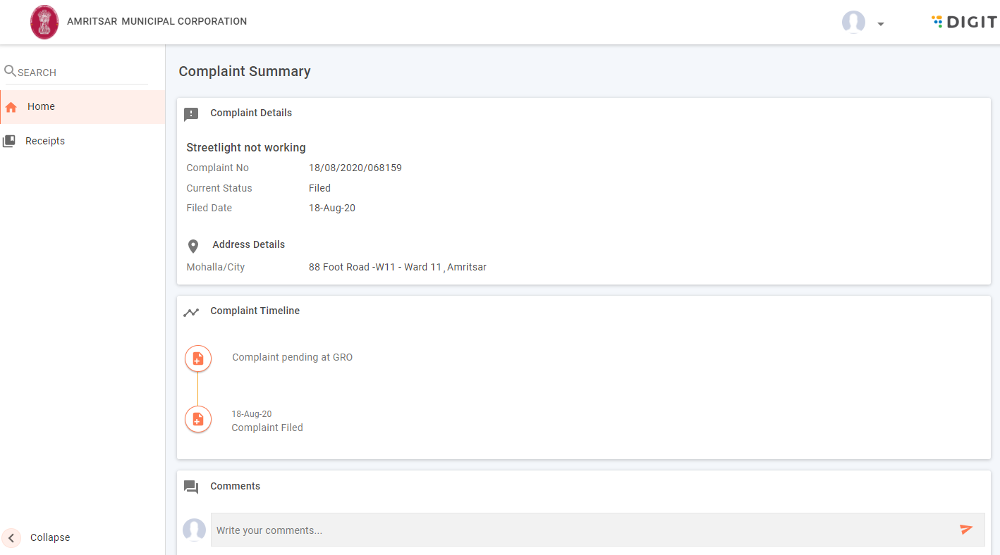

1. The complaint summary view contains the **Complaint Details**, **Complaint Timeline**, and **Comments** text box. The complaint timeline indicates the action taken on the complaint and the current or pending action status of the complaint.
2. Enter any additional information about the complaint in the **Comments** section.

#### Rate Complaints

The PGR module enables the citizens to give their feedback on resolved complaints.

To rate resolved complaints

1. Navigate to **Complaints** menu option in the sidebar.
2. Click on the **My Complaints** tab.
3. Scroll down to the complaint you want to rate.
4. You can rate only complaints marked as **Closed**.
5. Scroll down to the **Complaint Timeline** section.

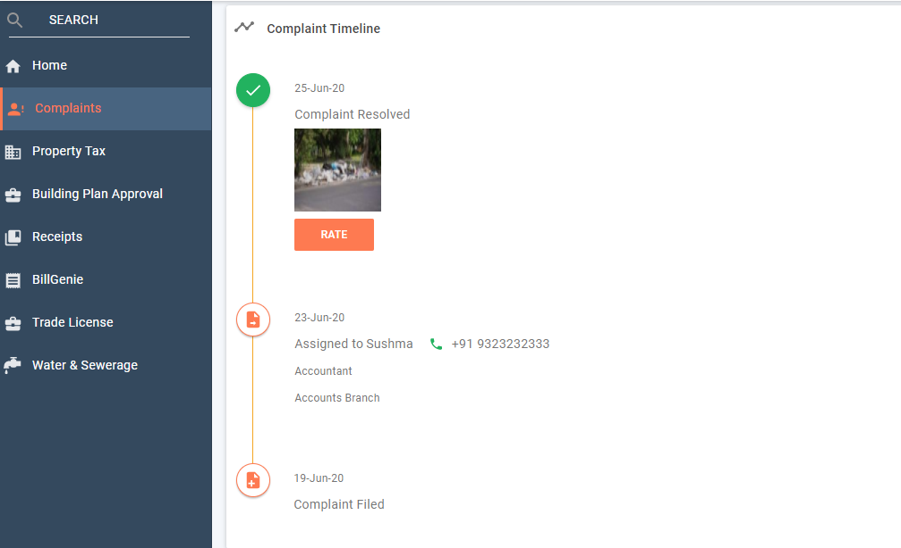

1. Click on the **Rate** button on the timeline.

1. Click on the number of stars on the screen to rate the work on the complaint on five.
2. Click on the most appropriate feedback statement to rate the work.
3. Add any additional information in the **Comments** section.
4. Click on the **Submit** button.
5. The system displays an acknowledgement for your ratings.
6. Click on the **Go To Home** button to navigate back to the home page.

#### Complaint Types List

<table>
  <thead>
    <tr>
      <th style="text-align:left"><b>Complaint Types</b>
      </th>
      <th style="text-align:left"><b>Complaints Sub-Types</b>
      </th>
    </tr>
  </thead>
  <tbody>
    <tr>
      <td style="text-align:left">Streetlights</td>
      <td style="text-align:left">
        <ol>
          <li>Streetlight not working</li>
          <li>Installation of new street light</li>
        </ol>
      </td>
    </tr>
    <tr>
      <td style="text-align:left">Garbage</td>
      <td style="text-align:left">
        <ol>
          <li>Garbage needs to be cleared</li>
          <li>Burning of garbage</li>
          <li>Damaged garbage bin</li>
          <li>Non-sweeping of road</li>
          <li>Congress grass-cutting</li>
        </ol>
      </td>
    </tr>
    <tr>
      <td style="text-align:left">Drains</td>
      <td style="text-align:left">
        <ol>
          <li>Overflowing/Blocked drain</li>
          <li>Cleaning of drains</li>
          <li>Water entered house rainy season</li>
        </ol>
      </td>
    </tr>
    <tr>
      <td style="text-align:left">Water &amp; Sewerage</td>
      <td style="text-align:left">
        <ol>
          <li>Illegal discharge of sewage</li>
          <li>Block/overflowing sewage</li>
          <li>Shortage of water</li>
          <li>Dirty water supply</li>
          <li>Broken water pipe/leakage</li>
          <li>Water pressure is very less</li>
          <li>No water supply</li>
          <li>Sewage main hole cover missing or broken</li>
          <li>Sewerage main hole cover raising</li>
          <li>Cleaning of sewerage moves slurry gear</li>
        </ol>
      </td>
    </tr>
    <tr>
      <td style="text-align:left">Property Tax/ House Tax</td>
      <td style="text-align:left">
        <ol>
          <li>How to pay property tax</li>
          <li>Wrong calculation</li>
          <li>Receipt not generated</li>
          <li>Others</li>
        </ol>
      </td>
    </tr>
    <tr>
      <td style="text-align:left">Roads &amp; Footpaths</td>
      <td style="text-align:left">
        <ol>
          <li>Damaged road</li>
          <li>Waterlogged road</li>
          <li>Manhole cover missing or broken</li>
          <li>Damaged/Blocked footpath</li>
          <li>Construction material lying on road</li>
          <li>Illegal rehries on road</li>
          <li>Road jalli broken</li>
        </ol>
      </td>
    </tr>
    <tr>
      <td style="text-align:left">Mosquitoes</td>
      <td style="text-align:left">
        <ol>
          <li>Request spraying or fogging operation</li>
        </ol>
      </td>
    </tr>
    <tr>
      <td style="text-align:left">Animals</td>
      <td style="text-align:left">
        <ol>
          <li>Stray animals</li>
          <li>Dead animals</li>
        </ol>
      </td>
    </tr>
    <tr>
      <td style="text-align:left">Public Toilets</td>
      <td style="text-align:left">
        <ol>
          <li>Dirty or smelly public toilets</li>
          <li>Public toilet damaged</li>
          <li>No water or electricity in public toilet</li>
        </ol>
      </td>
    </tr>
    <tr>
      <td style="text-align:left">Land Violations</td>
      <td style="text-align:left">
        <ol>
          <li>Illegal shops on footpath</li>
          <li>Illegal construction</li>
          <li>Illegal parking</li>
        </ol>
      </td>
    </tr>
    <tr>
      <td style="text-align:left">Trees</td>
      <td style="text-align:left">
        <ol>
          <li>Illegal cutting of trees</li>
          <li>Cutting or trimming of tree required</li>
        </ol>
      </td>
    </tr>
    <tr>
      <td style="text-align:left">Open Defecation</td>
      <td style="text-align:left">
        <ol>
          <li>Open defecation</li>
        </ol>
      </td>
    </tr>
    <tr>
      <td style="text-align:left">Parks</td>
      <td style="text-align:left">
        <ol>
          <li>Parks require maintenance</li>
        </ol>
      </td>
    </tr>
    <tr>
      <td style="text-align:left">Others</td>
      <td style="text-align:left"></td>
    </tr>
  </tbody>
</table>

### 

### CSR

Complaints can also be registered by ULB counter employees on behalf of the citizen.

The CSR or counter employees can perform the following actions on PGR -

1. Search or Track Complaints
2. File Complaints
3. Reopen Complaints

#### Search or Track Complaints

CSRs can search for specific complaints using the registered mobile number of citizens or by entering the last few digits of the complaint number.

To search complaints

1. Navigate to Complaints Home page.
2. Enter **Citizen Mobile No**.
3. Or, enter the last 6 digits of the **Complaint No.**

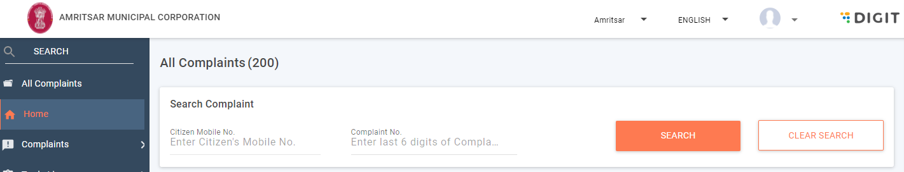

1. Click on the **Search** button.
2. The system will retrieve and display the matching records.

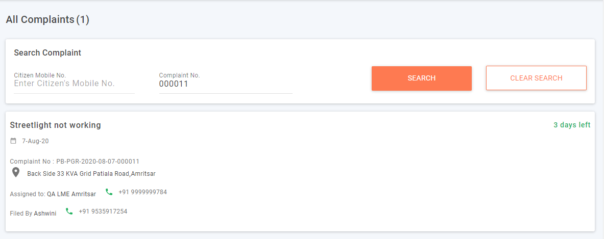

1. Click on the **Clear Search** button to initiate a fresh search.

#### File Complaints

To file complaints on behalf of the citizen

1. Navigate to **Home** page and click on the **Complaints** card.
2. Else, click on the **Complaints** menu option in the sidebar.
3. Click on **File Complaint** tab on the screen. This will open the complaint form page.

1. Enter the **Citizen Name**.
2. Enter **Citizen Mobile No.**
3. Select the relevant **Complaint Type** and the sub-type from the drop-down list of options. Refer to the list of complaint types available in PGR.
4. Enter any additional information in the **Complaint Additional Details** field.
5. The **City** field will display the city specified in your profile by default. You can change the city if required.
6. Choose the applicable **Locality/Mohalla** from the drop-down list.
7. Enter the **House No. and Street Name**.
8. Enter any **Landmark** to identify the exact location for the listed complaint.
9. Click on **File Complaint** button once you have finished filling in all the details.

1. The system will display the Complaint Registered Successfully message along with the Complaint No.
2. Click on the **Continue** button. Your complaint details are available on the dashboard.
3. Click on the complaint to view the complaint details.

#### Reopen Complaints

The CSR can reopen closed complaints on behalf of the citizens if required.

To reopen the complaint

1. Navigate to **Complaints** &gt; **Closed Complaints** menu option in the sidebar.
2. Click on the complaint you want to reopen.
3. Scroll down to the **Complaint Timeline** section.

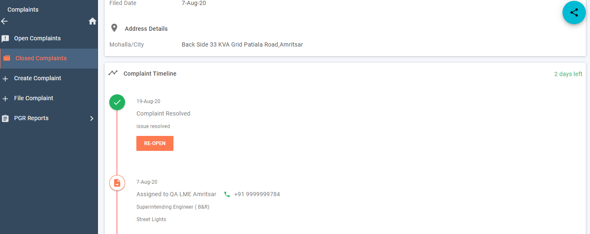

1. Click on the **Re-Open** button on the timeline.

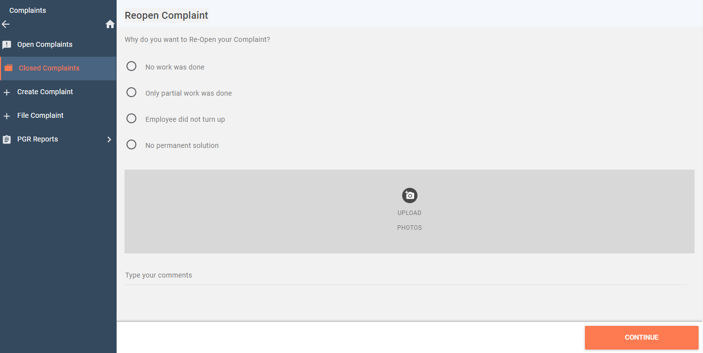

1. Select the appropriate reason for reopening the complaint.
2. Click on the camera icon to upload any photos related to the complaint.
3. Enter any additional information in the Comments section.
4. Click on the **Continue** button once done.
5. The system displays an acknowledgement message stating the complaint is reopened.
6. Click on **Go To Home** button to navigate back to the home page.

### 

### GRO

The Grievance Routing Officer or GRO manages the complaints queue. The role ensures the complaints are routed to the appropriate employees for prompt action.

GROs can

1. Assign complaints
2. Re-Assign complaints
3. Reject complaints

#### Assign Complaints

Grievances filed by citizens are assigned to specific employees who are responsible for acting on and resolving the complaints.

To assign complaints

1. Navigate to **Home** page and click on **Complaints** card.
2. Or, navigate to **Complaints &gt; Open Complaints**.
3. The GRO Complaint page contains two tabs - **Unassigned** and **Assigned** complaints.

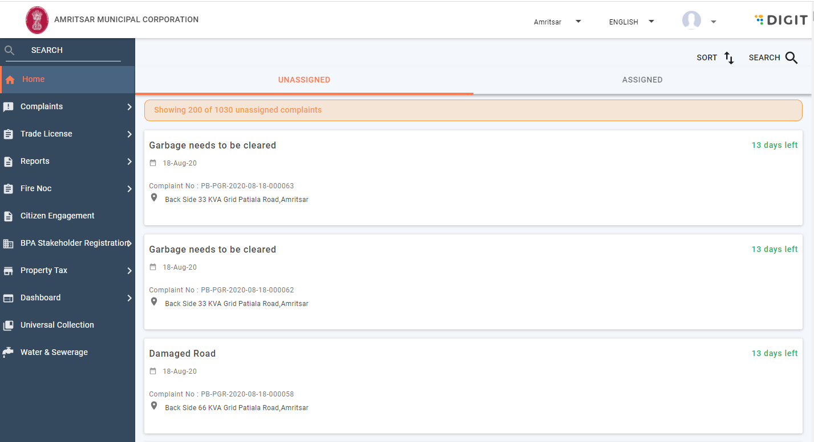

1. Click on **Unassigned** tab. The list of unassigned complaints is available on the screen.
2. Click on the **Complaint** you want to assign. This will open the **Complaint Summary** page.

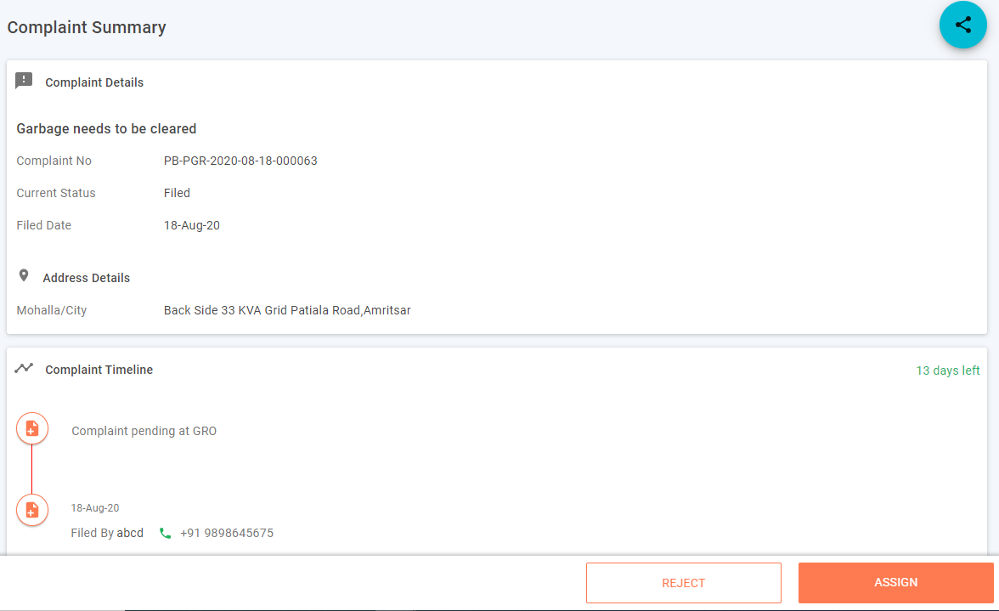

1. Click on the **Assign** button available in the bottom right corner of the screen. This will display the list of employees.
2. Select an employee.

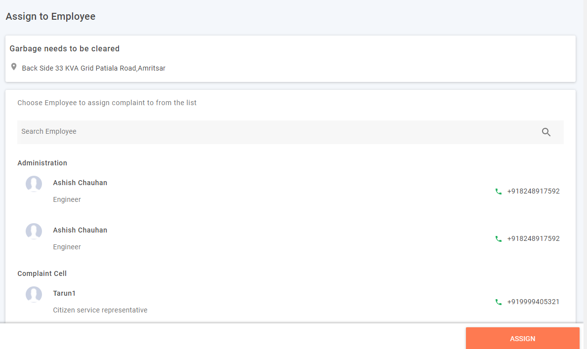

1. Click on the **Assign** button.

The complaint is assigned to the selected employee.

#### Re-Assign Complaints

Assigned complaints can be re-assigned by the GRO depending on the situation and requirements.

To re-assign complaints

1. Navigate to **Home** page and click on **Complaints** card.
2. Click on the **Assigned** tab.
3. Click on the complaint you want to re-assign.
4. Click on the **Re-Assign** button available on the bottom right corner of the screen.
5. Select the employee to whom the complaint should be assigned.
6. Click on the **Assign** button.

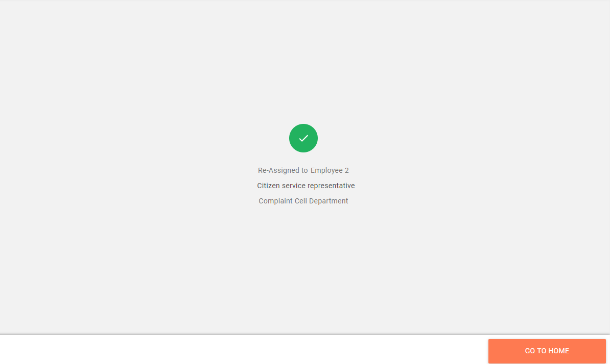

1. The Complaint is re-assigned to the selected employee.

To view Closed Complaints

1. Navigate to **Complaints &gt; Closed Complaints.**
2. The screen displays the list of closed complaints. Click on any complaint to view its details.

#### Reject Complaints

In certain cases, the GRO might reject registered complaints. This usually happens when the complaint is beyond the operational scope of the department or the complaint is invalid.

To reject complaints

1. Navigate to **Home** page and click on **Complaints** card.
2. Click on the **Complaint**. This will open the **Complaint Summary** page.
3. Click on the **Reject** button available in the bottom right corner of the screen.
4. Select the appropriate **Reason to Reject**.

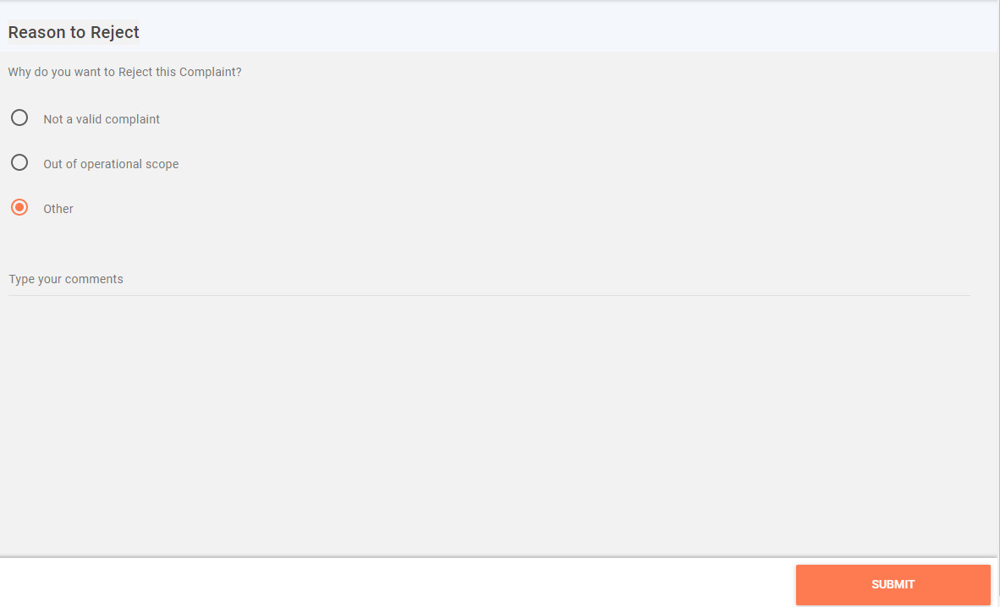

1. Add any additional information in the **Comments** space.
2. Click on the **Submit** button.
3. The complaint is rejected.

### 

### FME

First Mile Employees or FMEs are responsible for acting on citizen complaints.

FMEs can -

1. Request Re-Assign
2. Mark Resolved

#### Request Re-Assign

FMEs work on the assigned complaints. In some cases, the FMEs may request complaints to be re-assigned to some other employee.

To request reassign

1. Navigate to the **Complaints** menu option in the sidebar.
2. Click on **Open Complaints.**
3. Search for a specific complaint using the **Citizen Mobile No.** or inputting the last 6 digits of the **Complaint No**.

1. Else, click on the relevant complaint from the list of open complaints.
2. Click on the **Request Re-Assign** button available in the bottom right corner of the screen.

1. Select a specific reason for requesting a re-assign.

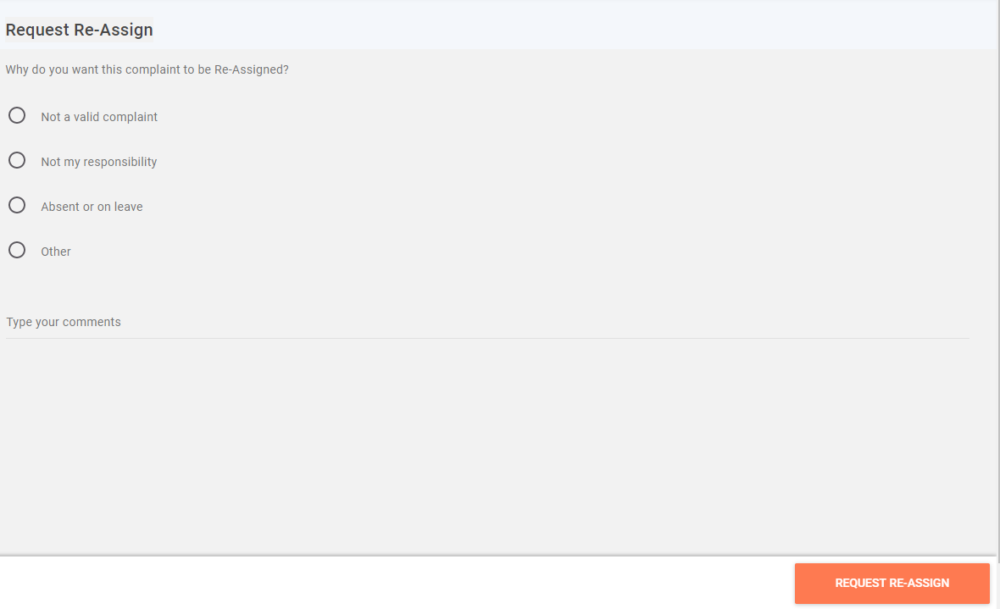

1. Enter any additional information in the **Comments** section.
2. Click on the **Request Re-Assign** button.

#### Mark Resolved

Once the complaints are actioned on the FME marks the issue resolved. The complaint is closed subsequently.

To mark the complaint resolved

1. Navigate to the **Complaints** menu option in the sidebar.
2. Click on **Open Complaints.**
3. Search for a specific complaint using the **Citizen Mobile No.** or inputting the last 6 digits of the **Complaint No**.

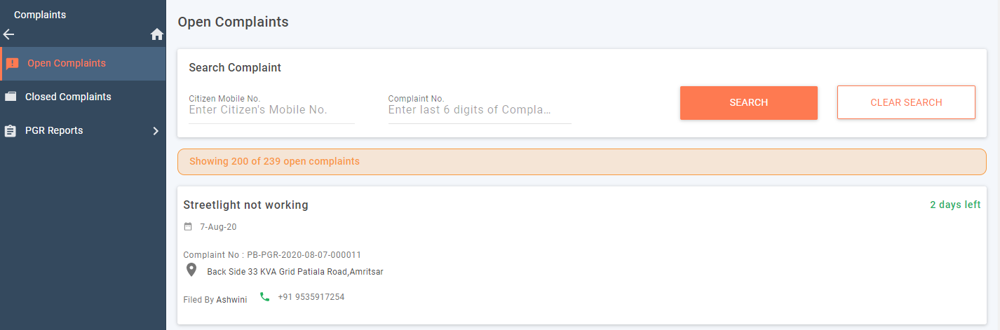

1. Else, click on the relevant complaint from the list of open complaints.
2. Click on the **Mark Resolved** button available in the bottom right corner of the screen.

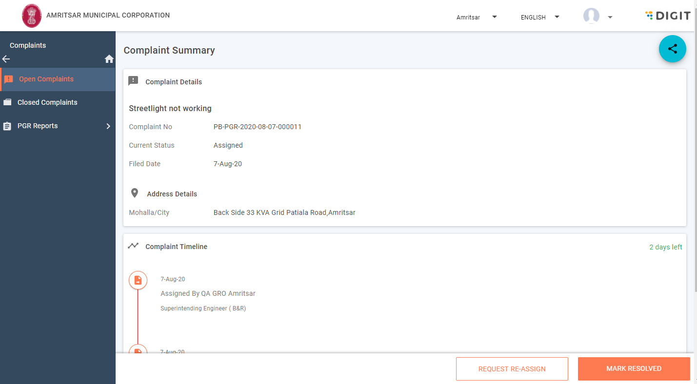

1. Click on the camera icon to upload photos as evidence that the issue has been resolved.

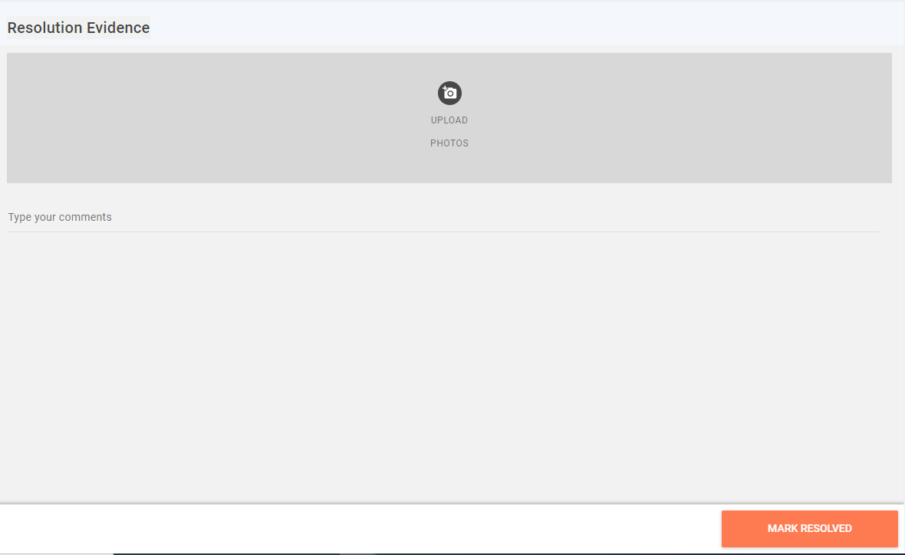

1. Enter any additional information related to the issue resolution in the **Comments** section.
2. Click on the **Mark Resolved** button.

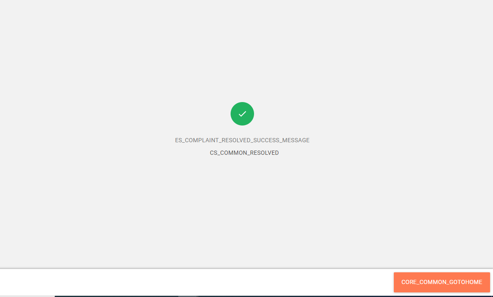

1. The system will display an acknowledgement message.
2. Click on the **Go To Home** button to navigate to the home page.

## Creating PGR Reports

Reports are printable or downloadable documents that offer insights and information linked to selected performance parameters. The PGR reports features allow system users to generate dynamic tables that make the information easy to comprehend.

Report types in PGR module are categorized by distinctive roles. So, each user can generate reports that offer rich insights specific to their role requirements.

The table below lists the various reports available to different user roles.

<table>
  <thead>
    <tr>
      <th style="text-align:left"><b>User Role</b>
      </th>
      <th style="text-align:left"><b>Report Types</b>
      </th>
    </tr>
  </thead>
  <tbody>
    <tr>
      <td style="text-align:left">CSR</td>
      <td style="text-align:left">
        <ol>
          <li>Employee Report</li>
        </ol>
      </td>
    </tr>
    <tr>
      <td style="text-align:left">GRO</td>
      <td style="text-align:left">
        <ol>
          <li>Complaint Type Wise Report</li>
          <li>ULB Employee Wise Report</li>
          <li>Source Wise Report</li>
          <li>Description Report</li>
          <li>ULB Department Report</li>
        </ol>
      </td>
    </tr>
    <tr>
      <td style="text-align:left">FME</td>
      <td style="text-align:left">
        <ol>
          <li>Employee Report</li>
        </ol>
      </td>
    </tr>
    <tr>
      <td style="text-align:left">ADMIN</td>
      <td style="text-align:left"></td>
    </tr>
  </tbody>
</table>

### 

### Generating Reports

To generate reports

1. Navigate to **PGR Reports** menu option in the sidebar.
2. Click on the relevant report type.
3. Select the **From Date** and **To Date** range in the **Modify Report by Date Range** tab.

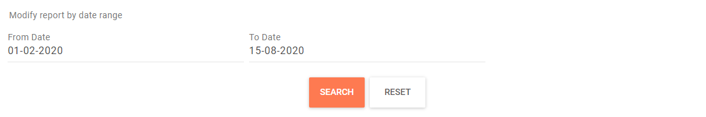

1. Click on the **Search** button.
2. The report for the defined period is generated and displayed on the screen.

### Navigating Reports

To navigate through the report

1. Click on the **Previous** or **Next** button at the bottom right corner of the report to navigate to the next page or previous page of the report.

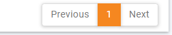

1. Enter the number of data rows you wish to view on each page of the report in the **Show Entries** box available in the top left side of the report. For instance, enter 20 if you want to view 20 records on each page.

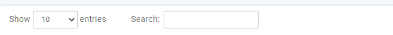

1. Enter a search keyword in the **Search** bar to search for specific data record in the report.

 Click on the **Collapse** button at the bottom left corner of the screen to minimize the sidebar. This will provide a full-screen view of the report.

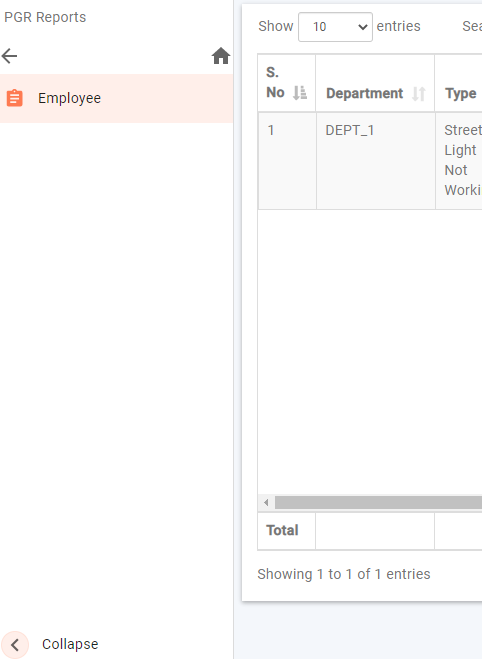

### Modifying Reports

1. Click on the **Column Visibility** button to remove some columns from the report.

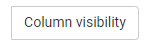

1. Click on the column name to enable or disable the view of that column in the report.

### Downloading Reports

1. Click on the **Download as** **PDF** or **XLS** button to download the report in pdf or excel format.

1. The downloaded report is saved on your device.

